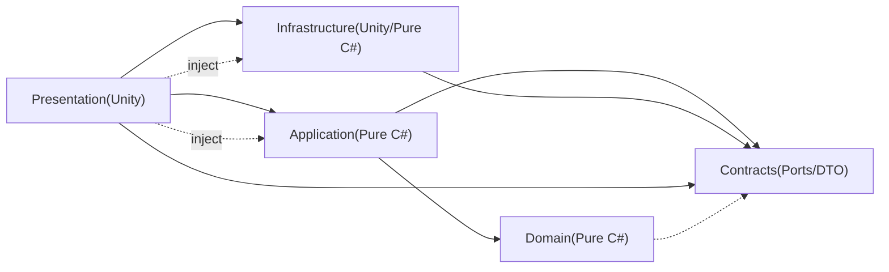
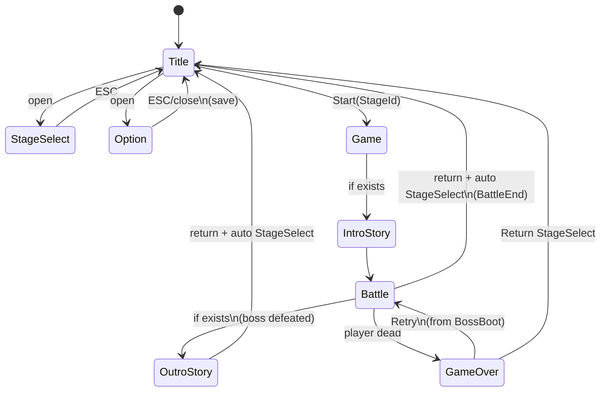
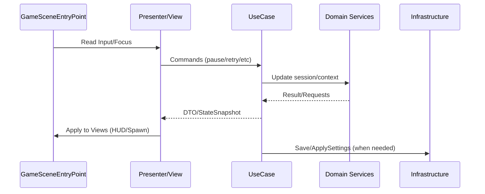

# アーキテクチャ設計書

## 0. 参照ドキュメント

* 要件定義書：シーン遷移、入力仕様、バトル/紙芝居/ポーズ、セーブ要件
* ドメインモデル設計書：バウンデッドコンテキスト、集約、主要エンティティ/サービス、Unity表現方針

本設計書は上記2つと矛盾しない形で、「コードの組み立て方（層分割・依存ルール・実装単位）」を確定する。

---

## 1. 目的

* 仕様追加・調整・バグ修正が入っても**崩れにくいコードの型**を決める。
* 「Unity依存（MonoBehaviour/UnityEngine）」と「ゲームルール（純C#）」の境界を固定する。
* 少人数・経験浅めでも運用できる**最小限の規律**で、完成までのリスクを下げる。

---

## 2. アーキテクチャ方針（結論）

**レイヤード + 薄いClean思想 + MVP（UI）** を採用する。

* Domain（純C#）：ゲームのルール・状態・集約
* Application（純C#）：ユースケース（画面/シーンを跨ぐ手順・進行）
* **Contracts（純C#）**：境界インタフェース（Ports）＋共有DTO（必要最小限）
* Presentation（Unity）：MonoBehaviour/UI/入力/演出/表示
* Infrastructure（Unity/純C#）：永続化、設定反映、外部入出力（Audio/Graphics等）

> Contracts を独立させることで、Application が Infrastructure を参照せずに「必要なI/O」を抽象化でき、asmdef循環参照を物理的に防ぎやすくする。

DIコンテナは採用しない（学習/運用コスト削減）。代わりに **Composition Root（EntryPoint）で手動DI** を行う。

---

## 3. 依存関係ルール（最重要）

### 3.1 依存方向

* Presentation → Application → Domain
* Presentation → Infrastructure
* Application → **Contracts（境界インタフェース/共有DTO）**
* Infrastructure → **Contracts（実装対象）**
* Domain は Presentation/Infrastructure を参照しない（必要があれば Contracts のみ参照可）

> 目的：Unity依存を外側に隔離し、ドメインのデバッグ容易性・再利用性を確保する。

### 3.2 Unity API 利用禁止ルール

* **Domain / Application では `UnityEngine` を参照しない**
* Unityの `Time`, `Random`, `Debug`, `Transform`, `AudioSource` 等が必要な場合は、Presentation/Infrastructure側で値を作って渡す。

### 3.3 イベント/通知のルール

* View（UI）→ Presenter：入力イベント（ボタン押下等）
* Presenter → Application：コマンド呼び出し（UseCase実行）
* Application → Presenter：結果（DTO/StateSnapshot）
* Domain → 外部：**直接イベント発火しない**（返り値/生成要求リストで表現）

---

## 4. レイヤ構成と責務

### 4.1 Domain（純C#）

**含める**

* 集約：SaveData / GameSession / BattleContext / StoryPlayer / FocusNavigationContext
* エンティティ：Player, Robot, Boss, Enemy, Bullet, ItemInstance, AttackIcon …
* 値オブジェクト：StageId, Volume, BattlePhase, InputRepeatState …
* ドメインサービス：DamageService, BattleFlowService, ItemSpawnService, EnemySpawnService, AttackSequenceService, PauseService …

**含めない**

* MonoBehaviour
* ScriptableObject（ただし「参照用ID」や「読み取り用インタフェース」は可）
* シーンロード、UI操作、Audio/Graphics設定の適用

### 4.2 Application（純C#）

**役割：ユースケース層**

* タイトル→ステージ選択→ゲーム開始→クリア→タイトル復帰の手順
* ステージクリア時の進行度更新・保存
* オプション変更の反映と保存（適用自体はInfrastructureに委譲）
* InGame中の Story → Battle → Story の切り替え

**主要クラス（例）**

* GameFlowUseCase（StartFromTitle/OpenStageSelect/OpenOption/StartGame/ReturnToTitleWithStageSelect）
* StageClearUseCase（StageResult→SaveData更新→保存）
* OptionUseCase（設定変更→適用→保存）

> ドメインモデル設計書にある GameFlowService 等は、実装では Application に置く（名前は Service/UseCase どちらでも良い）。

### 4.3 Presentation（Unity）

**役割：Unity実行環境との橋渡し**

* シーンに配置される EntryPoint（初期化・Updateループ）
* Controller/Presenter（MVP）：UIとUseCaseを繋ぐ
* View：Unity UI（Canvas/TMP/Slider/Selectable）
* 3D/2D表現：Prefab/Animator/Particle/AudioSource
* ObjectPool：Energy/EnemyBullet等

**注意**

* MonoBehaviourに「ルール」を書かない。書くのは「入力取得」「表示更新」「Unity固有の操作」だけ。

### 4.4 Infrastructure（Unity/純C#）

**役割：外部I/O**

* セーブ/ロード（JSON）
* 設定適用（Audio/Graphics）
* マスターデータ供給（ScriptableObject Repository）

**例**

* JsonSaveRepository（ISaveRepository実装）
* UnitySettingsApplier（ISettingsApplier実装：Audio/Graphics適用）
* ScriptableObjectMasterDataRepository（IMasterDataRepository実装）

### 4.5 Contracts（純C#）

**役割：境界（Ports）と共有データ（DTO）を置く薄い層**

* Application／Domain が「外部I/O」を必要とするときに参照する **インタフェース** を定義する
* asmdef循環参照と依存逆転の崩壊を防ぐため、Infrastructureには置かない

**含める（例）**

* `ISaveRepository`（Save/Load）
* `ISettingsApplier`（Audio/Graphicsの即時反映）
* `IMasterDataRepository`（SOマスター読み取り）
* `IAudioService` / `ISceneLoader` / `ITimeProvider`（必要に応じて）

**DTO（必要最小限）**

* `StageResult`, `OptionChange` など「層を跨いで渡す必要があるもの」

---

## 5. プロジェクト構成（フォルダ/asmdef）

### 5.1 推奨フォルダ

```
Assets/
  Scripts/
    Game/
      Domain/
      Application/
      Contracts/
      Infrastructure/
      Presentation/
        Boot/
        Title/
        InGame/
        UI/
      Shared/
  MasterData/
  Prefabs/
  Scenes/
```

### 5.2 asmdef（推奨）

* Game.Domain.asmdef（UnityEngine参照なし。必要に応じて Game.Contracts を参照可）
* **Game.Contracts.asmdef（UnityEngine参照なし。Domain/Application から参照される）**
* Game.Application.asmdef（UnityEngine参照なし。Domain/Contracts参照）
* Game.Infrastructure.asmdef（UnityEngine参照可。Domain/Contracts参照。※Applicationは参照しない）
* Game.Presentation.asmdef（UnityEngine参照可。全参照可）

> asmdefを切ることで「うっかり Domain に Unity API を書く」事故を防ぐ。

---

## 6. コンポジション（Composition Root）

### 6.1 EntryPoint

* BootEntryPoint（最初のシーン、または Title シーン内に常駐でも可）

  * IMasterDataRepository生成（SO実装）
  * SaveLoad（LoadOrCreateDefault）
  * GameSession生成（DontDestroyOnLoad）
  * グローバルサービス生成（Audio/Save/SceneLoader等）

* TitleSceneEntryPoint

  * TitlePresenter 初期化
  * StageSelect/Optionウィンドウの生成/表示制御

* GameSceneEntryPoint

  * StageIdからIntroStory有無を判定→Story/Battleを開始
  * Updateで BattleFlow/StoryPlayer を進行

> 「生成はEntryPointで、利用はPresenter/Controllerで」という構造にする。

### 6.2 サービス取得（手動DI）

* EntryPointで `GameServices` を生成し、必要なPresenter/Controllerへ渡す。
* シングルトンは最小限（例：GameSessionHolder、AudioService、SceneLoader）

```text
GameServices
  - IMasterDataRepository
  - ISaveRepository
  - ISettingsApplier
  - ISceneLoader
  - IAudioService
  - ITimeProvider（scaled/unscaled）

※上記インタフェースは Contracts に定義し、Infrastructure が実装する。
```

---

## 7. シーン構成と画面フロー

要件定義に合わせ、次の2〜3シーン構成を推奨。

* Boot（任意）
* Title
* Game

### 7.1 画面遷移（要件対応）

* Title

  * はじめる → Stage1 を開始（Gameへ）
  * ステージ選択（フローティングウィンドウ）
  * オプション（フローティングウィンドウ、即時反映、閉じる時保存）
  * やめる → アプリ終了
* Game

  * IntroStory（あれば）→ Battle → OutroStory（あれば）
  * 終了後 Title に戻り、ステージ選択ウィンドウを自動表示

---

## 8. InGameの状態機械（GameSession / BattlePhase）

Domainで以下を保持する。

* GameSession

  * GameMode：Title / StageSelect / Option / InGame
  * InGameMode：StoryBeforeBattle / Battle / StoryAfterBattle
  * isPaused
  * currentStageId
  * battleContext / storyPlayer

* BattleContext

  * BattlePhase：BattleStart → ConversationIntro → BossBoot → Combat → BossDefeated → ConversationOutro → BattleEnd / GameOver

### 8.1 ポーズ要件の実装指針

要件：ゲームオーバー中は不可、BGMは継続、SE/挙動は停止。

* Domain：PauseServiceが `session.isPaused` を切り替える（isGameOverなら拒否）
* Presentation：

  * ゲームのUpdate（Battle/Story進行）を停止、または scaledDelta=0 で更新
  * 物理/アニメ等は `Time.timeScale=0` を選択肢に（ただしUI入力は unscaled）
* Audio：

  * BGMは継続
  * SEは Pause中にミュート（SE用AudioMixerGroupを0へ）

---

## 9. UIアーキテクチャ（MVP）

### 9.1 ルール

* View（MonoBehaviour）は「見た目」と「入力イベント発火」だけ
* PresenterがUseCaseを呼び、結果をViewへ反映
* フォーカス移動は FocusNavigationService（Domain）で決定し、View側で Selectable を切り替える

### 9.2 主要Presenter例

* TitlePresenter

  * 「はじめる/ステージ選択/オプション/やめる」を扱う
* StageSelectPresenter

  * ステージ一覧のフォーカス/決定、ESCで閉じる
* OptionPresenter

  * BGM/SE音量、ON/OFF、画質（exe版のみ）を即時反映
* HUDPresenter

  * 自機HP、ボスHP（複数ゲージ）、エネルギー、特殊エネルギーを表示
* PauseMenuPresenter / GameOverPresenter

  * 再開/リトライ/ステージ選択に戻る 等

---

## 10. データ/マスターデータ設計（ScriptableObject）

### 10.1 マスターデータ（読み取り専用）

* StageDefinition
* PlayerStaticParams
* EnemyStaticParams / BossStaticParams
* AttackSequenceDefinition
* RobotBulletDefinition / EnemyBulletDefinition
* ItemDefinition
* StorySequenceDefinition

### 10.2 ランタイム状態

* SaveData：Serializable（JSON）
* GameSession / BattleContext：純C#、セーブ対象外（必要なら別途セーブ設計）
* ItemInstance/Bullet等：プール/リスト管理（セーブしない）

---

## 11. 永続化（セーブ/ロード）

要件：

* JSONでデータ管理
* 各ステージクリア時と、設定ウィンドウを閉じたときに保存
* 保存内容：ステージ解放、クリアランク、設定情報

### 11.1 インタフェース設計（Contracts）

* **ISaveRepository（Contracts）**

  * Save(SaveData)
  * LoadOrCreateDefault()

* **ISettingsApplier（Contracts）**

  * ApplySettings(GameSettings)

* **IMasterDataRepository（Contracts）**

  * GetStageDefinition(StageId)
  * GetPlayerStaticParams()
  * …（参照専用）

### 11.2 保存トリガ

* StageClearUseCase：StageResult受領 → SaveData更新 → Save
* OptionPresenter閉じる：OptionUseCase経由で Save

---

## 12. Updateループ設計（責務分担）

### 12.1 GameSceneの更新

* GameSceneEntryPoint.Update

  * 入力取得（Presentation）
  * Pause判定（PauseService/UseCase）
  * Story進行 or Battle進行（Domainサービス）
  * 生成要求の収集（弾/敵/アイテム）→ View/Poolへ反映
  * HUD更新（Presenter）

### 12.2 生成要求（SpawnRequest）パターン

Domainは「生成してほしい」という要求を返すだけ。

* RobotBulletSpawnRequest
* EnemySpawnRequest
* ItemSpawnRequest

PresentationがPrefab/Poolを使って実体化し、衝突等のUnityイベントを Domain に通知する。

---

## 13. コリジョン/ダメージ/吸収の橋渡し

要件：

* ダッシュ中：敵弾/雑魚敵を吸収→エネルギー化（即時獲得）
* ダッシュ中：ボス接触でダメージ
* 通常時：被弾→HP減少、3秒無敵

実装方針：

* UnityのTrigger/Collisionは Presentation の Controller が受ける
* 判定結果（何に当たったか、現在ダッシュか等）を Domain に渡し、

  * DamageService
  * ItemSpawnService（吸収/ドロップ）
    で処理する

---

## 14. オブジェクトプール方針

要件：エネルギーはObjectPool。弾もプール推奨。

* Presentationで `Pool<TView>` を管理
* DomainはBullet/Itemの寿命管理・消失フラグのみ
* View側は「寿命切れ/画面外/ヒット」を検知し、Domainへ通知→返却

---

## 15. 実装チェックリスト（運用ルール）

### 15.1 レイヤ侵食防止

* [ ] Domain/ApplicationにUnityEngine参照がない（asmdefで防止）
* [ ] MonoBehaviourのUpdateにゲームルールが肥大化していない

### 15.2 依存関係

* [ ] PresenterはUseCase経由で処理する（View→Domain直叩き禁止）
* [ ] シングルトンが増えていない（横断的：Audio/Save/Scene程度）

### 15.3 入力と時間

* [ ] UI入力は unscaled time でリピート制御
* [ ] Pause中はゲーム進行（Battle/Story）が止まる

### 15.4 セーブ

* [ ] ステージクリア時に Save
* [ ] オプション閉じる時に Save

---

## 16. 図（Mermaid）

### 16.1 レイヤ依存



> Application は Infrastructure を参照しない。Infrastructure は Contracts を実装し、EntryPoint（Presentation）が生成・注入する。

### 16.2 画面フロー（要件対応）



### 16.3 InGame更新の責務



---

## 17. 補足：命名規約（最低限）

* `*EntryPoint`：Composition Root / Update管理
* `*Presenter`：MVPのPresenter（UI更新、UseCase呼び出し）
* `*View`：UI/表示（MonoBehaviour）
* `*Controller`：ゲーム内オブジェクトのUnity側制御（Transform/Animator/Collider）
* `*UseCase`：Applicationの手順
* `*Service`：Domainサービス（計算/進行/判定）
* `*Repository`：Infrastructureの永続化/データ供給

---

## 18. 未確定事項（要件側のunknownを吸収する設計）

要件定義書に {unknown} が残っている項目（速度/減速率/クールタイム等）は、

* ScriptableObject（StaticParams）に寄せ、
* Domainは「値を受け取って動く」形にする。

これにより、後から数値が確定してもコード変更を最小化できる。
