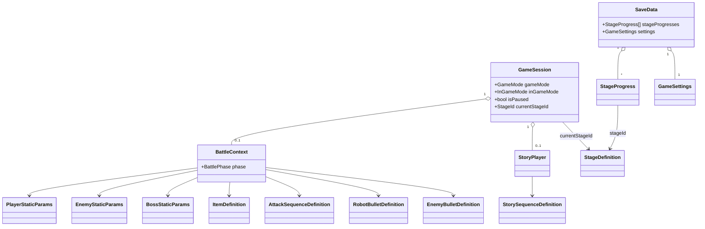
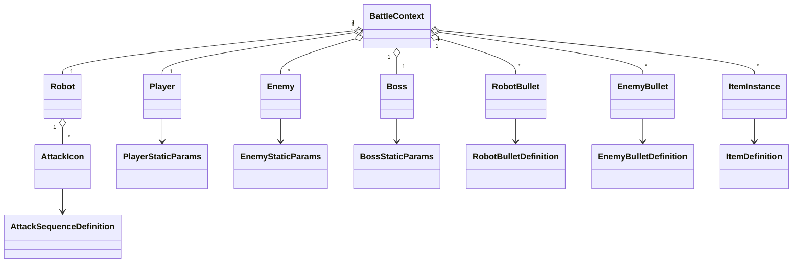
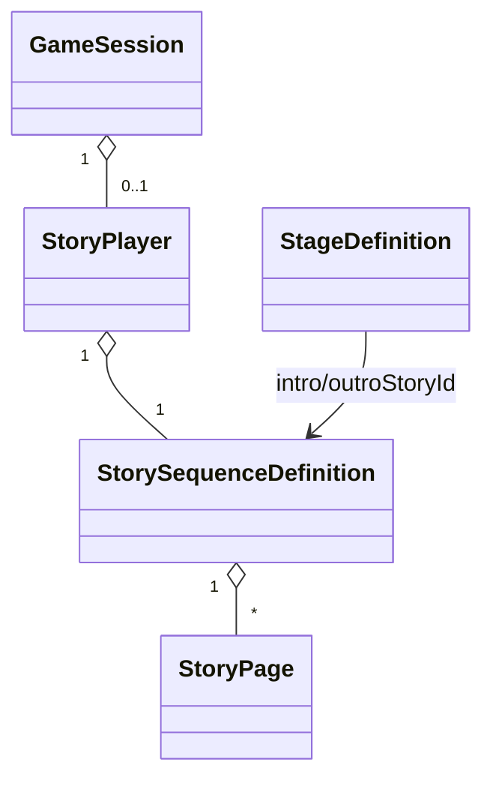
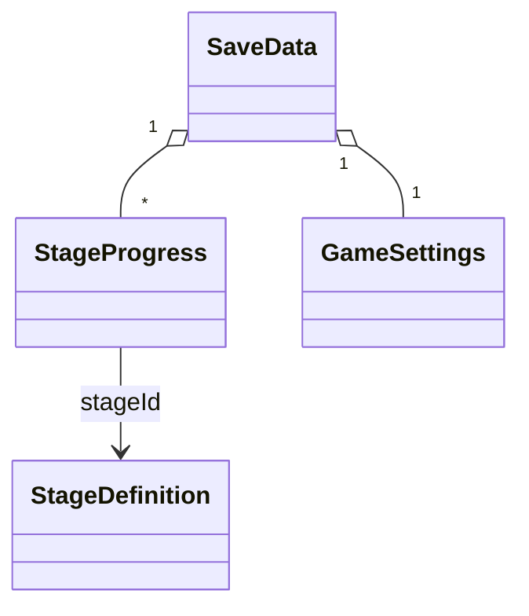
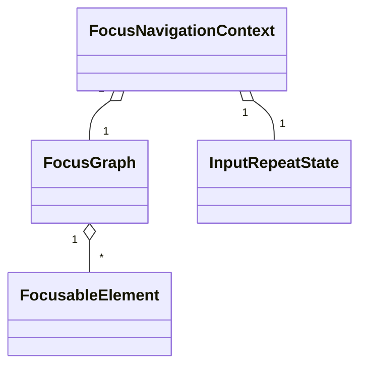

# ドメインモデル設計書

## 0. 目的と前提

本ドキュメントは、提示された要件定義書（タイトルシーン〜ゲームシーン／バトル／紙芝居／ポーズ／セーブ等）に基づき、このゲームの**ドメインモデル設計**を一箇所にまとめたものである。

- ゲームのルールや状態を表現する **エンティティ／値オブジェクト／サービス** を整理する。
- 各クラスの主な **振る舞い（メソッド）** を定義する。
- **関係性・集約（Aggregate）** を定義し、所有関係と参照関係を明確にする。
- それらを **Unity 上でどのコンポーネントとして表現するか** を定義する。
- アプリ全体やバトル、各エンティティの **状態とライフサイクル** を整理する。
- 最後に、クラス図等を **Mermaid** で簡易表示する。

設計方針：

- ゲームの「ルール」はできる限り Unity 非依存の **純C# ドメイン層** に閉じ込める。
- デザイナーが触る「パラメータ」は **ScriptableObject** にまとめる。
- 画面表示や入力、シーン遷移は **Unity の MonoBehaviour / UI** に寄せ、
ドメイン層とは Controller / Presenter で橋渡しする。
- セーブ/設定反映/マスターデータ読み取りなどの **外部I/O** はドメイン外とし、`ISaveRepository` や `ISettingsApplier` 等の **ポート（インタフェース）** として定義する。
    - ポートはアーキテクチャ設計書で定義する「Contracts（Ports）」に置き、Unity実装（JSON保存、AudioMixer反映、SO参照など）は Infrastructure が担う。

---

## 1. ドメイン境界とバウンデッドコンテキスト

要件から、次のようなサブドメイン（バウンデッドコンテキスト）に分割する。

1. **メタゲーム / セーブコンテキスト**
    - タイトル、ステージ選択、オプション、ステージ解放状況、クリアランク、設定情報
2. **ゲームセッションコンテキスト**
    - 今どのモードか（Title / InGame / StageSelect / Option）、どのステージを遊んでいるか、ポーズ状態
3. **紙芝居 / 会話コンテキスト**
    - 一枚絵＋テキストのシーケンス再生
4. **バトルコンテキスト**
    - バトルのフェーズ管理（開始〜会話〜ボス起動〜戦闘〜撃破〜終了〜ゲームオーバー）
    - プレイヤー、自機、ロボット、攻撃シーケンス、敵、ボス、Bullet、アイテム、ドロップ
5. **入力 / フォーカスコンテキスト**
    - UI上のフォーカス移動とリピート入力
6. **MasterData コンテキスト**（読み取り専用）
    - Stage, 各種 StaticParams, ItemDefinition, StorySequence 等

以降の設計はこれらのコンテキストを前提とする。

---

## 2. 主なエンティティ／値オブジェクト／サービス

### 2.1 メタゲーム / セーブ

**エンティティ**

- `SaveData`
    - ルートエンティティ。ゲーム全体のセーブ情報。
    - `StageProgress[] stageProgresses`
    - `GameSettings settings`
- `StageProgress`
    - 各ステージの進行状況。
    - `StageId stageId`
    - `bool isUnlocked`
    - `StageRank? clearRank`
- `GameSettings`
    - 設定情報。
    - `Volume bgmVolume`, `Volume seVolume`
    - `GraphicsSettings graphicsSettings`（解像度＋ウィンドウ／フルスクリーン）

**値オブジェクト**

- `StageId`, `StageRank`, `Volume`, `Resolution`, `WindowMode`, `GraphicsSettings`
    - `Volume` は内部に `value`（0〜1の実数）と `isEnabled`（ミュートON/OFF）を持ち、要件の「チェックボックスによるBGM/SEのオンオフ」を表現する。

**サービス（ドメイン外I/Oはポート化）**

- `ISaveRepository`（ポート / Contracts）
    - `Save(SaveData data)` / `LoadOrCreateDefault()`
- `ISettingsApplier`（ポート / Contracts）

> 補足：
「オプションを閉じたら保存する」「ステージクリア時に保存する」といった 保存タイミング は、ドメインの責務ではなく アプリケーション層（UseCase） が決め、必要に応じて ISaveRepository.Save() を呼ぶ。
これにより Application→Infrastructure 参照を避け、asmdef循環参照も防ぎやすくなる。
> 

---

### 2.2 ゲームセッション

**エンティティ**

- `GameSession`
    - 現在のゲーム状態と進行中の InGame 情報を保持。
    - `GameMode gameMode`（Title / StageSelect / Option / InGame）
    - `InGameMode inGameMode`（StoryBeforeBattle / Battle / StoryAfterBattle）
    - `bool isPaused`
    - `StageId currentStageId`
    - `BattleContext? battleContext`
    - `StoryPlayer? storyPlayer`

**値オブジェクト**

- `GameMode`, `InGameMode`, `PauseState`（NotPaused / Paused）

**サービス**

- `GameFlowService`
    - タイトル→ステージ選択→ゲームシーンなどのユースケース。
    - `StartFromTitle()`, `OpenStageSelect()`, `OpenOption()`, `StartGame(StageId)`,
    `ReturnToTitleWithStageSelect()`, `OnStageCleared(StageResult)`
- `PauseService`
    - `TryTogglePause(GameSession session)`
    - `Pause(GameSession session)`, `Resume(GameSession session)`
- `TitleMenuService`, `StageSelectionService`
    - タイトル画面・ステージ選択画面での選択処理。

---

### 2.3 紙芝居 / 会話

**エンティティ**

- `StoryPlayer`
    - `StoryState state`（Idle / Playing / Finished）
    - `StorySequence currentSequence`
    - `int currentPageIndex`

**値オブジェクト（＋MasterData）**

- `StorySequence`（VO）
    - `StoryId id`
    - `StoryPage[] pages`
- `StoryPage`
    - `SpriteId backgroundImageId`
    - `string text`
    - `SpeakerId? speaker`

**サービス**

- `StoryService`
    - `StartIntroStory(StageId stageId, StoryPlayer player)`
    - `StartOutroStory(StageId stageId, StoryPlayer player)`
    - `OnStoryFinished(GameSession session)`

---

### 2.4 バトル

### 2.4.1 バトル進行

**エンティティ**

- `BattleContext`
    - `BattlePhase phase`
    - `Player player`
    - `Robot robot`
    - `Boss boss`
    - `List<Enemy> enemies`
    - `List<RobotBullet> robotBullets`
    - `List<EnemyBullet> enemyBullets`
    - `List<ItemInstance> items`

**値オブジェクト**

- `BattlePhase`：`BattleStart`, `ConversationIntro`, `BossBoot`, `Combat`, `BossDefeated`, `ConversationOutro`, `BattleEnd`, `GameOver`

**サービス**

- `BattleFlowService`
    - フェーズ遷移／ゲームオーバー／ステージクリア等を制御。

---

### 2.4.2 プレイヤー / ロボット / 攻撃

**エンティティ**

- `Player`
    - 動的パラメータ：`currentHp`, `currentEnergy`, `currentSpecialEnergy`, `isDashing`, `isInvincible`, `dashCooldownRemaining`, `dashTimeRemaining` など
    - ダッシュ中のルール：`isDashing == true` の間は、敵および敵弾幕からダメージを受けず（実質的に無敵）、衝突した雑魚敵・敵弾幕を吸収してエネルギーを獲得する。ボスに接触した場合は、ダッシュ攻撃としてボスにダメージを与える。
- `Robot`
    - `AttackIcon[] attackIcons`
- `AttackIcon`
    - `AttackSequencePhase phase`（Ready / Starting / Attacking / Ending / Cooldown / Disabled）
    - `bool isAvailable`, `bool isRunning`

**値オブジェクト（＋MasterData）**

- `PlayerStaticParams`（SO）
    - HP最大、エネルギー最大、歩行基本速度、ダッシュ速度、無敵時間など
- `AttackSequenceStaticParams`（SO）
    - 使用エネルギー、各フェーズ時間

**サービス**

- `AttackSequenceService`
    - プレイヤーによるスイッチ踏み→攻撃シーケンス起動
    - フェーズ進行と BulletRobot 生成要求
- `DamageService`
    - プレイヤー・敵・ボス・弾に対するダメージ計算

---

### 2.4.3 Bullet / Item

**エンティティ**

- `RobotBullet`
    - `lifetimeRemaining`, `isActive`
- `EnemyBullet`
    - `elapsedTime`, `isVanished`
- `ItemInstance`
    - `ItemDefinition definition`
    - 状態：`Dropped`, `PickedUp`, `Merged`, etc.

**値オブジェクト（＋MasterData）**

- `RobotBulletStaticParams`, `EnemyBulletStaticParams`（SO）
- `ItemDefinition`（SO：回復薬／無敵／エネルギー／特殊エネルギー。種別ごとの効果量に加えて、同時にフィールド上に存在できる最大個数（例：回復3 / 無敵2 / エネルギー200）などの上限情報も持つ）

**サービス**

- `ItemSpawnService`
    - 敵撃破時や HP2割以下時のドロップ判定
    - ロボット内に時間経過や確率に応じてエネルギー（および必要に応じてその他のアイテム）が自然発生する処理を担う。例えば `UpdateNaturalSpawns(BattleContext ctx, float deltaTime)` のようなメソッドで、ロボット内エリアからランダムな位置を選び、エネルギーのスポーンリクエストを返す。
    - `OnEnemyKilled(Enemy enemy, bool killedByDash)` において、`killedByDash == true` の場合はプレイヤーへ直接エネルギーやアイテム効果を付与し、`false` の場合は `ItemInstance` をフィールド上にドロップすることで「ダッシュ撃破は直接入手／通常撃破はフィールドドロップ」を表現する。
    - 個数上限超過時の削除。上限値は `ItemDefinition` に定義された値を用い、古い `ItemInstance` から順に削除するポリシーとする。
- `DropService`
    - 敵・ボス撃破／Boss被弾時のエネルギードロップ計算
    - ドロップ位置の決定において、ロボット前方に重み付けしたランダム分布を用いることで「ロボット前方のほうに落ちやすい」要件を満たす。

---

### 2.4.4 敵・ボス

**エンティティ**

- `Enemy`
    - `currentHp`
    - `TakeDamage(Damage)` / `IsAlive()`
- `Boss`
    - `currentGaugeIndex`
    - `currentHpInGauge`
    - `TakeDamage(Damage, time)`
    - `IsAllGaugesEmpty()`
    - `CanDropEnergy(time)`（0.1秒間隔制限）

**値オブジェクト（＋MasterData）**

- `EnemyStaticParams`（SO）
- `BossStaticParams`（SO）

**サービス**

- `EnemySpawnService`
    - ボスの攻撃パターンとフェーズに応じて雑魚敵をスポーンさせる責務を持つ。例えば `UpdateBossEnemySpawns(Boss boss, BattleContext ctx, float currentTime)` のようなメソッドで、Boss の現在フェーズと攻撃パターン定義（MasterData）を参照しながら `EnemySpawnRequest` を生成し、`BattleContext` 内の `enemies` コレクションに新たな `Enemy` を追加するきっかけを提供する。

---

### 2.5 UI / フォーカス / 入力

**エンティティ**

- `FocusNavigationContext`
    - `FocusGraph graph`
    - `FocusableElement current`
    - `InputRepeatState repeatState`
- `FocusGraph`
    - `neighbors: Map<FocusableElement, List<FocusableElement>>`
- `FocusableElement`
    - `ElementId id`

**値オブジェクト**

- `InputRepeatState`（firstDelay=0.5s, repeatDelay=0.2s, nextMoveTime など）

**サービス**

- `FocusNavigationService`
    - `OnMoveInput(FocusDirection dir, float time)`
    - `GetNext(FocusableElement current, FocusDirection dir)`

UI表示用の ViewModel（HPゲージやボスゲージなど）は、必要に応じて値オブジェクトとして定義する（例：`PlayerHpViewModel`, `BossHpViewModel`）。

---

## 3. 主要クラスの振る舞い（メソッド）

### 3.1 GameSession / Flow

```csharp
class GameSession {
    void StartStage(StageId stageId);
    void FinishStage(StageResult result);

    void EnterTitle();
    void EnterStageSelect();
    void EnterOption();
    void EnterInGame();
    void EnterGameOver();

    void EnterStoryBeforeBattle();
    void EnterBattle();
    void EnterStoryAfterBattle();

    bool CanPause();
    void SetPaused(bool paused);

    bool IsInGame();
    bool IsPaused();
}

class GameFlowService {
    void StartFromTitle();
    void OpenStageSelect();
    void OpenOption();

    void StartGame(StageId stageId);
    void ReturnToTitleWithStageSelect();

    void OnStageCleared(StageResult result);
}

class PauseService {
    bool TryTogglePause(GameSession session);
    void Pause(GameSession session);
    void Resume(GameSession session);
}
```

---

### 3.2 StoryPlayer / StoryService

```csharp
class StoryPlayer {
    void Start(StorySequence sequence);
    void NextPage();
    bool IsFinished();
}

class StoryService {
    void StartIntroStory(StageId stageId, StoryPlayer player);
    void StartOutroStory(StageId stageId, StoryPlayer player);
    void OnStoryFinished(GameSession session);
}
```

---

### 3.3 BattleContext / BattleFlowService

```csharp
class BattleContext {
    void SetPhase(BattlePhase phase);
    BattlePhase GetPhase();

    void Setup(StageId stageId);
    void ResetForRetry();

    bool IsCombatPhase();
    bool IsGameOver();
    bool IsBossDefeated();
}

class BattleFlowService {
    void StartBattle(BattleContext ctx, GameSession session);
    void Update(BattleContext ctx, GameSession session, float deltaTime);

    void OnIntroConversationFinished(BattleContext ctx);
    void OnBossBootFinished(BattleContext ctx);
    void OnCombatBossHpZero(BattleContext ctx);
    void OnOutroConversationFinished(BattleContext ctx);

    void OnPlayerDead(BattleContext ctx, GameSession session);
    void OnRetrySelected(BattleContext ctx, GameSession session);
    void OnReturnToStageSelect(BattleContext ctx, GameSession session);
}
```

---

### 3.4 Player / Robot / AttackIcon

```csharp
class Player {
    void Move(Vector2 inputDir, Robot robot, float deltaTime);

    bool CanStartDash();
    void StartDash();
    void UpdateDash(float deltaTime);
    void StopDash();

    void TakeDamage(Damage damage);
    bool IsAlive();
    bool IsInvincible();

    bool CanUseEnergy(int amount);
    void ConsumeEnergy(int amount);
    void AddEnergy(int amount);

    bool CanUseSpecialEnergy(int amount);
    void ConsumeSpecialEnergy(int amount);
    void AddSpecialEnergy(int amount);

    void Heal(int amount);
    void ApplyInvincible(float duration);
}

class Robot {
    AttackIcon? GetAttackIconAtPosition(Vector2 position);
}

class AttackIcon {
    bool IsAvailable();
    bool IsRunning();

    bool CanStart(Player player);
    void Start(Player player);
    void Update(float deltaTime);
    void Finish();

    AttackSequencePhase GetPhase();
}

class AttackSequenceService {
    bool TryTriggerAttack(Robot robot, Player player, Vector2 switchPosition);
    void UpdateSequences(Robot robot, float deltaTime);
    IEnumerable<RobotBulletSpawnRequest> CollectSpawnRequests(Robot robot);
}
```

---

### 3.5 Bullet / Item / Enemy / Boss

```csharp
class RobotBullet {
    void Initialize(RobotBulletStaticParams @static);
    void Update(float deltaTime);
    bool IsExpired();
    bool ShouldDestroyOnHit();
}

class EnemyBullet {
    void Initialize(EnemyBulletStaticParams @static);
    void Update(float deltaTime);
    bool IsExpired();
    bool IsVanished();
    void Vanish();
}

class ItemInstance {
    bool CanBePickedUpBy(Player player);
    void OnPickedUp(Player player);

    bool CanMerge(ItemInstance other);
    void MergeWith(ItemInstance other);
}

class ItemSpawnService {
    IEnumerable<ItemSpawnRequest> OnEnemyKilled(Enemy enemy, bool killedByDash);
    IEnumerable<ItemSpawnRequest> OnBossDamagedByRobot(Boss boss, RobotBullet bullet, float time);

    IEnumerable<ItemSpawnRequest> TrySpawnLowHpHeal(Player player, float time);
    ///<summary>
    /// ロボット内で時間経過や確率に応じてエネルギー（および必要に応じてその他アイテム）を自然発生させる。
    ///</summary>
    IEnumerable<ItemSpawnRequest> UpdateNaturalSpawns(BattleContext ctx, float deltaTime);

    void EnforceItemLimit(IList<ItemInstance> items);
}

class EnemySpawnService {
    ///<summary>
    /// ボスの攻撃パターンに応じて雑魚敵スポーン要求を生成する。
    /// Boss の現在フェーズや攻撃シーケンス定義（MasterData）を参照する。
    ///</summary>
    IEnumerable<EnemySpawnRequest> UpdateBossEnemySpawns(Boss boss, BattleContext ctx, float currentTime);
}

class Enemy {
    void TakeDamage(Damage damage);
    bool IsAlive();
}

class Boss {
    void TakeDamage(Damage damage, float currentTime);
    bool IsAlive();
    bool IsCurrentGaugeEmpty();
    bool IsAllGaugesEmpty();
    int GetCurrentPhaseIndex();

    bool CanDropEnergy(float currentTime);
    int GetDropEnergyAmount(int baseDrop, float multiplier);
}
```

---

### 3.6 SaveData / フォーカス

```csharp
class SaveData {
    StageProgress GetStageProgress(StageId id);
    void SetStageProgress(StageProgress progress);
    void UpdateStageClear(StageId id, StageRank rank);
}

class FocusNavigationContext {
    void SetGraph(FocusGraph graph);

    void OnMoveInput(FocusDirection dir, float currentTime);
    bool CanMove(FocusDirection dir, float currentTime);
    FocusableElement GetNext(FocusableElement current, FocusDirection dir);

    void ResetRepeat();
}
```

---

## 4. 関係性（関連・集約）設計

### 4.1 集約一覧

1. **SaveData 集約**
    - ルート: `SaveData`
    - 構成: `StageProgress*`, `GameSettings`
    - 参照: `StageDefinition`（MasterData）
2. **GameSession 集約**
    - ルート: `GameSession`
    - 構成: `BattleContext?`, `StoryPlayer?`
    - 参照: `StageDefinition`, `SaveData`（サービス経由）
3. **BattleContext 集約**
    - ルート: `BattleContext`
    - 構成: `Player`, `Robot`（`AttackIcon*`）, `Boss`, `Enemy*`, `RobotBullet*`, `EnemyBullet*`, `ItemInstance*`
    - 参照: 各種 StaticParams / ItemDefinition（MasterData）
4. **StoryPlayer 集約**
    - ルート: `StoryPlayer`
    - 構成: `StorySequence`（VO）
    - 参照: `StorySequenceDefinition`（MasterData）
5. **FocusNavigation 集約**
    - ルート: `FocusNavigationContext`
    - 構成: `FocusGraph`, `FocusableElement*`, `InputRepeatState`
6. **MasterData コンテキスト**
    - ScriptableObject 群。どの集約にも属さず、読み取り専用で参照される。

### 4.2 集約内・集約間の関係

- `SaveData` 1 − * `StageProgress`
- `SaveData` 1 − 1 `GameSettings`
- `StageProgress` → `StageDefinition`（StageIdによる参照）
- `GameSession` 1 − 0..1 `BattleContext`
- `GameSession` 1 − 0..1 `StoryPlayer`
- `BattleContext` 1 − 1 `Player`
- `BattleContext` 1 − 1 `Robot`
- `Robot` 1 − * `AttackIcon`
- `BattleContext` 1 − 1 `Boss`
- `BattleContext` 1 − * `Enemy`
- `BattleContext` 1 − * `RobotBullet`
- `BattleContext` 1 − * `EnemyBullet`
- `BattleContext` 1 − * `ItemInstance`
- `StoryPlayer` 1 − 1 `StorySequence`
- `StorySequence` 1 − * `StoryPage`
- `FocusNavigationContext` 1 − 1 `FocusGraph`
- `FocusGraph` 1 − * `FocusableElement`

MasterData は、`StageDefinition`, `PlayerStaticParams`, `EnemyStaticParams`, `BossStaticParams`, `AttackSequenceDefinition`, `ItemDefinition`, `StorySequenceDefinition` 等で構成され、各集約から参照されるのみとする。

---

## 5. Unity での表現方法（マッピング方針）

### 5.1 基本方針

- **ドメインロジック / 状態**：純C#クラスとして実装し、UnityEngine への依存を持たせない。
- **マスターデータ（静的パラメータ）**：ScriptableObject としてアセット化し、ドメイン側は ID や参照で読むだけにする。
- **表示・入力・演出**：MonoBehaviour / UI オブジェクトとして実装し、ドメインからは直接触らず Presenter や Controller 経由でつなぐ。

### 5.2 MasterData（ScriptableObject）

- `StageDefinition`
- `PlayerStaticParams`
- `EnemyStaticParams` / `BossStaticParams`
- `AttackSequenceDefinition`
- `RobotBulletDefinition` / `EnemyBulletDefinition`
- `ItemDefinition`
- `StorySequenceDefinition`
- これらは `ScriptableObject` としてアセットに保持し、読み取りは `IMasterDataRepository`（ポート / Contracts）越しに提供する。
    - Unity実装例：`ScriptableObjectMasterDataRepository : IMasterDataRepository`（Infrastructure）

### 5.3 SaveData / GameSession

- `SaveData`
    - `[Serializable]` な純C#クラスとして実装する（Unity依存なし）。
    - 永続化は `ISaveRepository`（ポート / Contracts）越しに行い、JSON形式の実装は `JsonSaveRepository : ISaveRepository`（Infrastructure）が担う。
- `GameSession`
    - 純C#クラスとして実装。
    - `GameSessionHolder : MonoBehaviour`（`DontDestroyOnLoad`）が 1つだけインスタンスを保持する。

### 5.4 BattleContext とエンティティ群

- 全て **純C#**：`BattleContext`, `Player`, `Robot`, `AttackIcon`, `Boss`, `Enemy`, `RobotBullet`, `EnemyBullet`, `ItemInstance`。
- Unity側：
    - `BattleEntryPoint : MonoBehaviour`
        - シーン開始時に MasterData と GameSession を元に `BattleContext` を生成。
        - `Update()` 内で `BattleContext` や `BattleFlowService` を更新。
    - `PlayerController`, `EnemyController`, `BossController`, `RobotController`, `BulletView`, `ItemView` 等
        - 入力や Transform/Animator を扱うプレゼンテーション層。
    - `BulletPool : MonoBehaviour`
        - RobotBullet / EnemyBullet 用の ObjectPool。

### 5.5 紙芝居

- `StoryPlayer`：純C#
- `StorySequenceDefinition`：ScriptableObject
- `StoryPresenter : MonoBehaviour`：
    - StoryPlayer + StorySequenceDefinition を参照し、Image / Text に反映
    - 入力(Space/A)で `NextPage()` を呼ぶ

### 5.6 UI・フォーカス・メニュー

- メニュー系 UI：Unity UI (Canvas + Button + Text/TMP)
- `FocusNavigationService`：純C#でロジック実装
- `FocusNavigationBehaviour : MonoBehaviour`：入力取得＋`Selectable.Select()` 呼び出し
- 各種 Presenter：
    - `PlayerHpPresenter`, `BossHpPresenter`, `EnergyGaugePresenter`, `SpecialEnergyPresenter`, `GameOverMenuPresenter`, `PauseMenuPresenter` など

### 5.7 シーン構成

- Bootstrapシーン
    - `GameSessionHolder` を常駐（`DontDestroyOnLoad`）
    - 外部I/O実装（Infrastructure）を生成し、以降は **ポート（Contracts）** 経由で参照する
        - `ScriptableObjectMasterDataRepository : IMasterDataRepository`
        - `JsonSaveRepository : ISaveRepository`
        - `UnitySettingsApplier : ISettingsApplier`
        - `AudioService`（必要なら `IAudioService` を介す）
    - 起動直後に `ISaveRepository.LoadOrCreateDefault()` で `SaveData` を復元し、起動後にタイトルシーンをロード。
- タイトルシーン
    - タイトルUI、ステージ選択UI、オプションUI。
    - `TitleSceneEntryPoint` が GameFlowService と SaveData を使用してボタン操作を処理。
- ゲームシーン
    - バトル用背景・ロボット・ボス・HUD・紙芝居用Canvas 等。
    - `GameSceneEntryPoint` が GameSession と MasterData を読み、BattleContext / StoryPlayer を生成＆更新。

---

## 6. 状態とライフサイクル設計（概要）

### 6.1 アプリ全体の状態

- `AppState`: `Boot` → `Title` → `InGame` → … → `Exiting`
- シーンレベルでは Bootstrap / Title / GameScene が対応する。

### 6.2 GameSession

- `GameMode`: `Title`, `StageSelect`, `Option`, `InGame`
- `InGameMode`: `StoryBeforeBattle`, `Battle`, `StoryAfterBattle`
- `PauseState`: `NotPaused`, `Paused`

InGame への出入りに合わせて、`BattleContext` や `StoryPlayer` の生成・破棄を行う。

### 6.3 BattleContext / BattlePhase

- `BattlePhase`:
    - `BattleStart`
    - `ConversationIntro`
    - `BossBoot`
    - `Combat`
    - `BossDefeated`
    - `ConversationOutro`
    - `BattleEnd`
    - `GameOver`

リトライ時は `ResetForRetry()` により内部状態を初期化し、`BossBoot` から再開する。

### 6.4 StoryPlayer

- `StoryState`: `Idle` → `Playing` → `Finished`
- イントロ／アウトロの紙芝居ごとに一時的に生成され、完了後に破棄される。

### 6.5 Player / AttackIcon / Bullet / Item / Enemy / Boss

- Player
    - 生存: `Alive` / `Dead`
    - ダッシュ: `NotDashing` / `Dashing` / `DashRecovery`
    - 無敵: `Normal` / `Invincible`
- AttackIcon
    - `Disabled` → `Ready` → `Starting` → `Attacking` → `Ending` → `Ready` or `Cooldown` → …
- Bullet (Robot / Enemy)
    - `Inactive`（プール内）→ `Active` → `Expired`（寿命/ヒット/画面外）→ プールに返却
- ItemInstance
    - `Inactive` → `Dropped` → `PickedUp` or `Merged` or 強制削除
- Enemy
    - `Alive` → `Dying`（任意）→ `Dead`
- Boss
    - 複数ゲージとフェーズを持つ `Alive` → 全ゲージ0で `Defeated`

### 6.6 UI の状態

- GameMode と BattlePhase / PauseState を読み取り、
    - タイトルUI / ステージ選択UI / オプションUI
    - InGame HUD
    - ポーズUI
    - ゲームオーバーUI の表示・非表示を制御する。

---

## 7. Mermaid 図（クラス構造）

### 7.1 集約全体図



### 7.2 BattleContext 内部



### 7.3 紙芝居



### 7.4 SaveData / 設定



### 7.5 フォーカスナビゲーション



---

以上が、本要件定義書に基づく「ドメインモデル設計書」の初期版である。実装フェーズでは、本書を基に C# クラス／ScriptableObject／MonoBehaviour を具体化し、必要に応じてクラスの分割・統合や責務の微調整を行う。