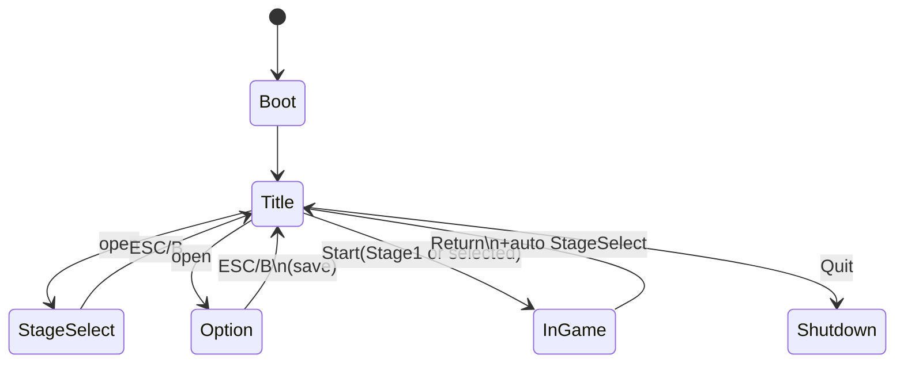
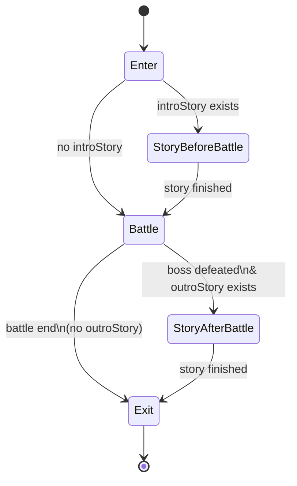
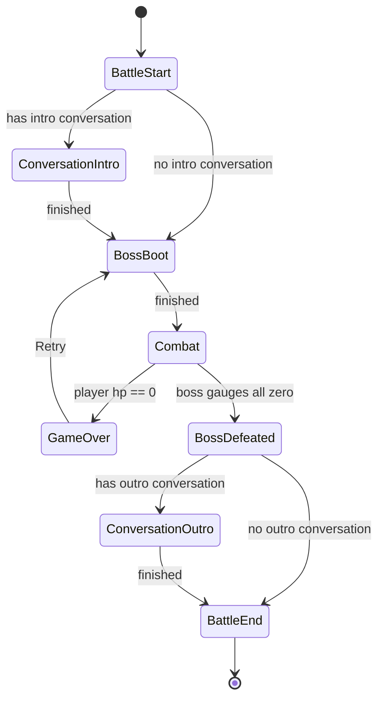

# 状態遷移・フロー設計書

## 0. 目的

本書は、要件定義・ドメインモデル・アーキテクチャ・データ設計に整合する形で、
**ゲーム全体の状態遷移（Game Flow）**と、**InGame 内の進行（紙芝居／バトル／ポーズ／ゲームオーバー）**を、実装に落とせる粒度で確定する。

* 状態の真実（Single Source of Truth）を **1箇所**に固定し、状態変更の窓口を明示する。
* 「シーン遷移」「UIフローティング（ステージ選択／オプション）」「InGame進行」「ポーズ／ゲームオーバー」を **表・図・ガード条件**で残す。

---

## 1. スコープと用語

### 1.1 ここで扱う「状態」のレイヤ

本作は以下の **3レイヤ**で状態を扱う。

1. **アプリ／画面レイヤ（GameMode）**：

* タイトル／ステージ選択／オプション／ゲーム（InGame）など、プレイヤー体験上のモード。
* シーン構成は **Title Scene / Game Scene**（必要なら Boot）。
* ステージ選択・オプションは **タイトル画面上のフローティングUI**（ただしモードとしては排他的に扱う）。

2. **InGame レイヤ（InGameMode）**：

* Game Scene 内での進行：**紙芝居(前) → バトル → 紙芝居(後)**。

3. **バトルレイヤ（BattlePhase）**：

* バトル進行のフェーズ：開始／会話／ボス起動／戦闘／撃破／終了／ゲームオーバー。

> ※キャラクターの Idle/Walk/Attack 等の局所FSMは本書の範囲外（別設計）。

### 1.2 入力ルール（共通）

* 決定：**Space / A**
* キャンセル（閉じる・戻る）：**ESC / B**
* ポーズ：**ESC / Start（Menu）**
* 紙芝居／会話の文章送り：**Space / A**
* フォーカス移動：矢印/WASD/スティック/十字（押しっぱなしリピート：初回0.5s、以後0.2s）

---

## 2. 状態の真実（Single Source of Truth）と状態変更の窓口

### 2.1 真実の置き場

* **Domain：GameSession** が「現在の状態の真実」を保持する。

  * `GameMode`（Title / StageSelect / Option / InGame）
  * `InGameMode`（StoryBeforeBattle / Battle / StoryAfterBattle）
  * `PauseState`（Paused/NotPaused）
  * `currentStageId`、`BattleContext`、`StoryPlayer` など

### 2.2 状態変更の窓口（Application）

状態変更・シーン遷移・保存トリガは **Application（UseCase）** に集約する。

* `GameFlowUseCase`

  * StartFromTitle
  * OpenStageSelect / CloseStageSelect
  * OpenOption / CloseOption
  * StartGame(StageId)
  * ReturnToTitleWithStageSelect
* `OptionUseCase`

  * 設定変更 → 即時反映（ISettingsApplier）
  * オプション閉じる時に保存（ISaveRepository）
* `StageClearUseCase`

  * クリア結果反映（SaveData更新）→ 保存（ISaveRepository）

### 2.3 禁止事項（運用ルール）

* UI の OnClick から **SceneManager.LoadScene 直叩き禁止**
* Player/Enemy/Boss 等の個別コンポーネントが **GameMode / BattlePhase を直接書き換え禁止**
* すべて「通知（イベント/コールバック）」→「UseCaseが判断」→「GameSession更新」の経路に統一する。

---

## 3. 全体フロー（GameMode）

### 3.1 GameMode 一覧（責務・入出力）

#### Boot（任意）

* 目的：初期化、SaveDataロード、MasterData準備
* Enter：`ISaveRepository.LoadOrCreateDefault()`、設定反映（ISettingsApplier）、Titleへ
* Exit：なし

#### Title

* 目的：メインメニュー表示（はじめる／ステージ選択／オプション／やめる）
* Enter：タイトルUI表示、フォーカス初期化
* Exit：遷移先に応じてフローティングUI破棄/非表示

#### StageSelect（タイトル上のフローティング）

* 目的：ステージを選択して開始
* Enter：ステージ一覧表示、解放状況反映、フォーカス初期化
* Exit：ウィンドウを閉じる

#### Option（タイトル上のフローティング）

* 目的：設定変更（即時反映）
* Enter：現在設定をUIへ反映
* Exit：閉じる際に保存（OptionUseCase）

#### InGame（Game Scene）

* 目的：ステージ進行（紙芝居→バトル→紙芝居）
* Enter：StageIdを受け取り、Story/Battleの初期化
* Exit：終了後は Title へ戻し、**StageSelectを自動表示**

#### Shutdown

* 目的：アプリ終了

---

### 3.2 GameMode 遷移テーブル（高レベル）

| 現在          | トリガー               | 次                 | ガード/備考                       |
| ----------- | ------------------ | ----------------- | ---------------------------- |
| Boot        | 初期化完了              | Title             | Bootを採用しない場合は初回Titleから開始     |
| Title       | 「はじめる」             | InGame            | 既定ステージ=Stage1（stage_01）      |
| Title       | 「ステージ選択」           | StageSelect       | タイトル上にフローティング表示              |
| StageSelect | 決定（Space/A）        | InGame            | 選択StageIdで開始                 |
| StageSelect | キャンセル（ESC/B）       | Title             | ウィンドウを閉じる                    |
| Title       | 「オプション」            | Option            | タイトル上にフローティング表示              |
| Option      | キャンセル（ESC/B）       | Title             | **閉じたタイミングで保存**              |
| Title       | 「やめる」              | Shutdown          | アプリ終了                        |
| InGame      | ステージ終了（BattleEnd後） | Title→StageSelect | Titleへ戻して**StageSelect自動表示** |
| InGame      | 「ステージ選択に戻る」        | Title→StageSelect | ポーズ/ゲームオーバーから発生              |

---

### 3.3 高レベル状態図（Mermaid）

---

## 4. InGameフロー（InGameMode）

### 4.1 InGameMode の定義

* `StoryBeforeBattle`：ステージ開始時の紙芝居（存在する場合のみ）
* `Battle`：バトル進行
* `StoryAfterBattle`：撃破後の紙芝居（存在する場合のみ）

> StageDefinition の hasIntroStory / hasOutroStory（StoryId）で有無判定する。

### 4.2 InGameMode 遷移テーブル

| 現在                | トリガー                | 次                           | ガード/備考                           |
| ----------------- | ------------------- | --------------------------- | -------------------------------- |
| InGame.Enter      | ステージ開始              | StoryBeforeBattle or Battle | introStoryがあれば前者、なければBattle      |
| StoryBeforeBattle | StoryFinished       | Battle                      | 文章送りは Space/A                    |
| Battle            | BossDefeated→Outro有 | StoryAfterBattle            | バトル内会話(アウトロ)はBattlePhase側で扱っても良い |
| Battle            | BattleEnd（終了処理完了）   | InGame.Exit                 | Titleへ戻す（StageSelect自動表示）        |
| StoryAfterBattle  | StoryFinished       | InGame.Exit                 | Titleへ戻す（StageSelect自動表示）        |
| Battle            | GameOver            | GameOverUI（BattlePhase）     | ゲームオーバーはBattlePhaseで表現           |

### 4.3 InGame進行図（Mermaid）

---

## 5. バトルフロー（BattlePhase）

### 5.1 BattlePhase 一覧

* `BattleStart`：バトル関連開始処理（表示準備、操作不能）
* `ConversationIntro`：導入会話（Space/Aで送り）※無い場合はスキップ
* `BossBoot`：タイトル表示→ボス起動、HPUI準備
* `Combat`：戦闘（自機/ロボ/アイテム/弾/敵が動作可能）
* `BossDefeated`：撃破演出／リザルト表示（必要なら）
* `ConversationOutro`：撃破後会話（あれば）
* `BattleEnd`：終了処理（ステージクリア確定→戻り）
* `GameOver`：自機HP=0

### 5.2 BattlePhase 遷移テーブル

| 現在                | トリガー                 | 次                              | ガード/備考                   |
| ----------------- | -------------------- | ------------------------------ | ------------------------ |
| BattleStart       | 開始処理完了               | ConversationIntro or BossBoot  | 会話が無ければBossBoot          |
| ConversationIntro | 会話終了                 | BossBoot                       | Space/Aで送り               |
| BossBoot          | 起動演出終了               | Combat                         |                          |
| Combat            | ボス全ゲージ0              | BossDefeated                   |                          |
| Combat            | 自機HP=0               | GameOver                       | **GameOver中はポーズ不可**      |
| BossDefeated      | 演出完了                 | ConversationOutro or BattleEnd | アウトロ会話有無                 |
| ConversationOutro | 会話終了                 | BattleEnd                      |                          |
| BattleEnd         | 終了処理完了               | （InGame.Exit）                  | Titleへ戻す→StageSelect自動表示 |
| GameOver          | UI:Retry             | BossBoot                       | **BossBootから再開**（状態初期化）  |
| GameOver          | UI:ReturnStageSelect | （Title→StageSelect）            | タイトルへ戻す→StageSelect自動表示  |

### 5.3 バトル状態図（Mermaid）

---

## 6. ポーズ（PauseState）

### 6.1 ポーズの要件（止めるもの／止めないもの）

* ポーズ入力：ESC / Start
* ポーズ可能：**ゲームオーバー中以外**、紙芝居／会話中も可
* 停止する：自機、敵、アイテム、Bullet、ロボット、パーティクル、（ポーズUI以外の）SE、紙芝居/会話の進行・演出
* 継続する：ポーズUI、UI入力、BGM（流れ続ける。必要なら音量調整）

### 6.2 ポーズ遷移

| 現在         | トリガー        | 次                 | ガード/備考                       |
| ---------- | ----------- | ----------------- | ---------------------------- |
| Paused=No  | Pause入力     | Paused=Yes        | **BattlePhase!=GameOver** のみ |
| Paused=Yes | 「再開」        | Paused=No         |                              |
| Paused=Yes | 「リトライ」      | BossBoot          | **Combat中にポーズした場合のみ表示**      |
| Paused=Yes | 「ステージ選択に戻る」 | Title→StageSelect | Titleへ戻す→StageSelect自動表示     |

### 6.3 実装上の注意（時間）

* UI入力・フォーカス移動は **unscaled time** で動かす。
* ゲーム進行（Story/Battle更新）は Pause中に止める。

  * 方針例：`if (session.IsPaused) return;` + 演出/物理は必要に応じ `Time.timeScale=0`。

---

## 7. ゲームオーバー（GameOver）

### 7.1 GameOverの要件

* 発生条件：Combat中に自機HP=0
* 可能操作：

  * リトライ（BossBootからやり直し。自機・ボスを初期状態へ）
  * ステージ選択に戻る（Titleへ戻す→StageSelect自動表示）
* 制約：**ゲームオーバー中はポーズ不可**

---

## 8. 保存（Save/Load）とフローの結合点

### 8.1 保存タイミング

* **ステージクリア時**（BattleEnd確定時）：

  * `StageClearUseCase` が SaveData（アンロック／ランク）更新 → `ISaveRepository.Save`
* **オプションを閉じた時**（Option→Title）：

  * `OptionUseCase` が 設定反映（ISettingsApplier）→ `ISaveRepository.Save`

### 8.2 保存内容（SaveData）

* ステージのアンロック状況
* 各ステージのクリアランク
* 設定情報（BGM/SE音量、ON/OFF、画質等）

---

## 9. 例外経路・ガード条件（最低限）

### 9.1 非同期（シーンロード等）

* シーンロード・初期化が非同期になる場合：

  * **Loading状態（内部）**を設け、完了コールバックでは「まだその状態か？」を確認してから遷移する。

### 9.2 代表ガード条件

* Pause入力は `BattlePhase != GameOver` のときのみ有効。
* Retryは `BattlePhase == GameOver` または `Paused==Yes && in Combat` のときのみ有効。
* StageSelect/Option は TitleScene 上でのみ開く（InGameからは「Titleへ戻ってから開く」）。

---

## 10. 実装配置（どこに書くか）

* **Domain**

  * `GameSession` / `BattleContext` / `StoryPlayer` / `PauseService` / `BattleFlowService` / `StoryService`
* **Application**

  * `GameFlowUseCase` / `StageClearUseCase` / `OptionUseCase`
* **Presentation（Unity）**

  * `BootEntryPoint` / `TitleSceneEntryPoint` / `GameSceneEntryPoint`
  * `TitlePresenter` / `StageSelectPresenter` / `OptionPresenter`
  * `PauseMenuPresenter` / `GameOverPresenter` / `HUDPresenter` / `StoryPresenter`
* **Infrastructure**

  * `JsonSaveRepository`（ISaveRepository）
  * `UnitySettingsApplier`（ISettingsApplier）
  * `ScriptableObjectMasterDataRepository`（IMasterDataRepository）

---

## 11. 完了条件（本設計書のDoD）

* [ ] GameMode / InGameMode / BattlePhase / PauseState が定義され、遷移表がある
* [ ] 「Title→StageSelect/Option」「InGame終了後のTitle復帰＋StageSelect自動表示」が明記されている
* [ ] ポーズの停止対象が列挙され、GameOver中は不可が明記されている
* [ ] RetryがBossBootからであることが明記されている
* [ ] 保存トリガ（ステージクリア／オプション閉じ）がフローに結合されている
* [ ] 状態変更の窓口（UseCase）と禁止事項（直叩き禁止）が明記されている
