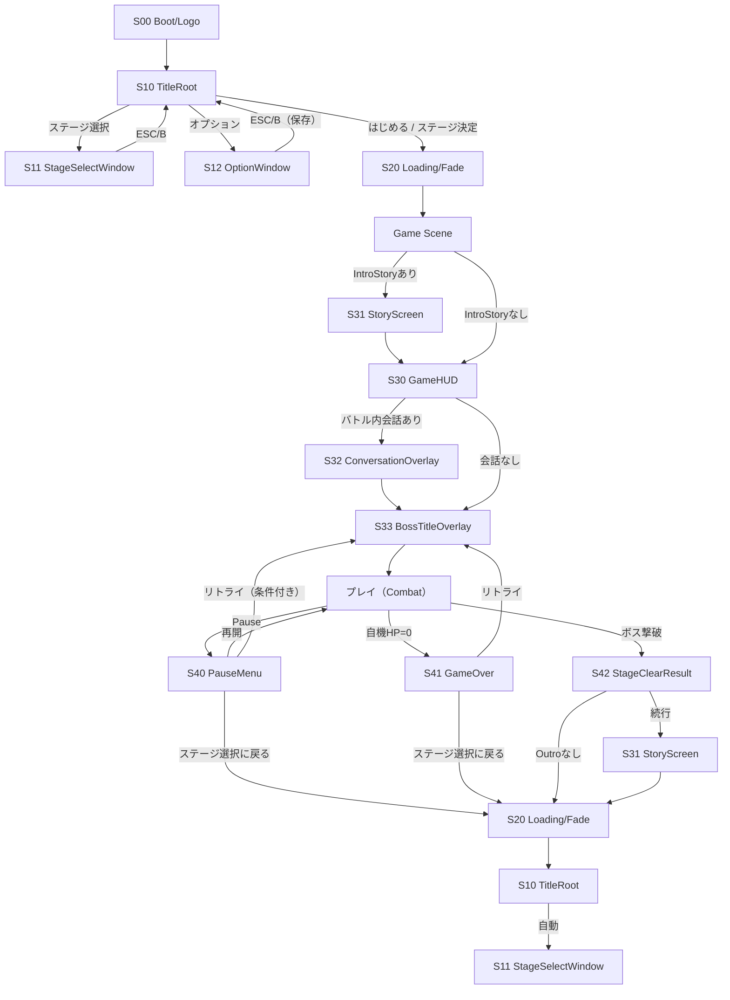

# UI・画面フロー設計書

## 0. 目的

本書は、ゲーム全体の **UI / 画面（Screen）** を洗い出し、
「どの画面からどこへ遷移できるか」「戻る（ESC/B）の意味」「モーダルの重なり」「入力デバイス（KB/Pad）でのフォーカス移動」
を **図と表で固定**する。

併せて、各画面の責務（表示／入力受付／発火するイベント）を定義し、
UIがドメインロジックやScene遷移を直叩きしない（UseCase窓口にリクエストする）運用ルールを明確化する。

---

## 1. 前提（入力・戻るルール）

### 1.1 共通入力

* 決定：**Space / A**
* 戻る（閉じる・キャンセル）：**ESC / B**
* ポーズ：**ESC / Start（Menu）**
* 文章送り（紙芝居／会話）：**Space / A**
* フォーカス移動：WASD/矢印/スティック/十字

### 1.2 「戻る」の原則

* 画面は **スタック（Screen Stack）** として扱う。
* 「戻る」は **最前面の画面を1つ閉じる（pop）** が原則。
* 例外は本書に明記し、実装で一元管理する（各UIが勝手に戻り先を決めない）。

---

## 2. 画面一覧（Screen Inventory）

画面は「全面（Full）」と「重ね（Overlay/Modal）」に分類する。

| ID  | 画面名                     | 種別                   | 常駐/生成 | 主な用途                                 |
| --- | ----------------------- | -------------------- | ----- | ------------------------------------ |
| S00 | Boot/Logo（任意）           | Full                 | 生成    | 初期化・Saveロード後にTitleへ                  |
| S10 | TitleRoot               | Full                 | 常駐    | タイトルメニュー（はじめる／ステージ選択／オプション／やめる）      |
| S11 | StageSelectWindow       | Modal（Title上）        | 常駐    | ステージ選択（フローティング）                      |
| S12 | OptionWindow            | Modal（Title上）        | 常駐    | 設定（即時反映、閉じると保存）                      |
| S20 | Loading/Fade            | Overlay（System）      | 常駐    | シーン切替や重い初期化の待ち表示                     |
| S30 | GameHUD                 | Overlay（InGame）      | 常駐    | InGame中のHUD（HP/エネルギー/特殊エネルギー/ボスHPなど） |
| S31 | StoryScreen（紙芝居）        | Full/Overlay（InGame） | 常駐    | 一枚絵＋文章。前後ストーリー表示                     |
| S32 | ConversationOverlay（会話） | Overlay（InGame）      | 常駐    | バトル開始前後の会話ログ（Space/A送り）              |
| S33 | BossTitleOverlay        | Overlay（InGame）      | 常駐    | ボス起動時のタイトル表示                         |
| S40 | PauseMenu               | Modal（InGame）        | 常駐    | 再開／（条件付き）リトライ／ステージ選択へ                |
| S41 | GameOver                | Modal（InGame）        | 常駐    | リトライ／ステージ選択へ（GameOver中はポーズ不可）        |
| S42 | StageClearResult（任意）    | Modal（InGame）        | 常駐    | 撃破演出後の簡易リザルト（ランク等）                   |
| S50 | ConfirmDialog（任意）       | Modal（System）        | 常駐    | 終了確認など（必要なら）                         |

> StageSelect/Option は「フローティングウィンドウでタイトルの上に描画」という要件を、TitleRoot上のモーダルとして実現する。

---

## 3. 画面フロー（Screen Flow）

### 3.1 全体フロー図

### 3.2 画面スタック（重なり）ルール

* TitleRoot（S10）がベース。

  * StageSelect（S11）と Option（S12）は **TitleRootの上に1枚だけ**出る（同時表示しない）。
* InGameでは GameHUD（S30）がベース。

  * StoryScreen（S31）は HUD を隠す（フルスクリーン）。
  * Conversation（S32）/ BossTitle（S33）は HUD の上に重ねて表示。
  * Pause（S40）/ GameOver（S41）/ ClearResult（S42）は **モーダル**（入力を占有）。
* Loading/Fade（S20）は常に最前面（System Overlay）。

---

## 4. 「戻る（ESC/B）」の意味を統一（優先順位）

| 最前面Screen               | ESC/Bの動作          | 備考                   |
| ----------------------- | ----------------- | -------------------- |
| S20 Loading/Fade        | 無効                | 二重遷移防止               |
| S50 ConfirmDialog       | キャンセル（閉じる）        | 任意                   |
| S41 GameOver            | 無効（UIボタンのみ）       | 要件：GameOver中はポーズ不可   |
| S40 PauseMenu           | 「再開」相当（閉じる）       | ただし項目選択と同じ動作に統一しても良い |
| S42 StageClearResult    | 「続行」相当（閉じる）       | 任意（設計方針）             |
| S11 StageSelectWindow   | 閉じてTitleへ         | 要件通り                 |
| S12 OptionWindow        | 閉じてTitleへ（保存）     | 要件通り                 |
| S31 StoryScreen         | 次の文章へ（Space/Aと同等） | ※戻るで閉じない（原則）         |
| S32 ConversationOverlay | 次の文章へ（Space/Aと同等） | ※戻るで閉じない（原則）         |
| S10 TitleRoot           | （任意）終了確認 or 何もしない | 仕様によりS50を出す          |
| InGame Combat（HUDベース）   | Pause（S40）を開く     | ESCはポーズに割当           |

---

## 5. 画面仕様（目的・表示・操作・発火イベント）

## 5.1 S10 TitleRoot

**目的**：ゲーム開始・各サブ画面への入口。

**表示**

* タイトルロゴ
* メニュー（縦並び）

  * はじめる（Stage1開始）
  * ステージ選択
  * オプション
  * やめる

**操作**

* フォーカス移動：WASD/十字
* 決定：Space/A

**発火イベント（UI→UseCase）**

* StartDefaultStage()（はじめる）
* OpenStageSelect()
* OpenOption()
* QuitRequest()

---

## 5.2 S11 StageSelectWindow（Title上フローティング）

**目的**：複数ステージ（約5）から開始ステージを選ぶ。

**表示**

* ステージ一覧（displayName、ロック状態）
* 選択中ステージの詳細（任意）：

  * クリアランク（SaveData.stageProgresses.clearRank）
  * 解放条件メモ（任意）

**操作**

* フォーカス移動：WASD/十字
* 決定：Space/A → 選択ステージ開始
* 戻る：ESC/B → 閉じる

**発火イベント**

* StartGame(stageId)
* CloseStageSelect()

**ガード**

* isUnlocked==false のステージは決定不可（フォーカスは可/不可を方針化）

---

## 5.3 S12 OptionWindow（Title上フローティング）

**目的**：設定変更（即時反映）。閉じる時に保存。

**表示**

* BGM音量：スライダー（0..1）＋ON/OFFチェック
* SE音量：スライダー（0..1）＋ON/OFFチェック
* 画質（exe版のみ）：

  * 解像度ドロップダウン
  * ウィンドウ/フルスクリーン切替

**操作**

* スライダー調整／チェック切替
* 戻る：ESC/B → 閉じる

**発火イベント**

* ApplyOptionChange(change)（変更の都度：即時反映）
* CloseOptionAndSave()（閉じる時：保存トリガ）

---

## 5.4 S30 GameHUD（常時表示）

**目的**：プレイに必要な状態を常に提示。

**表示（最低限）**

* 自機：HP（数値 or バー）
* エネルギー：現在値/最大（ダッシュ・攻撃シーケンス等の源）
* 特殊エネルギー：ストック数（最大3）
* ボス：HPゲージ（複数ゲージ対応）＋現在フェーズ
* （任意）アイテムスロット／所持数
* （任意）攻撃アイコン起動ボタン（要件：ステージ上のボタンで開始）

**操作**

* HUD自体は入力を占有しない（プレイ入力優先）。
* オンスタッチ/クリック用ボタンを設ける場合は、Pad/KBと競合しない導線に限定。

---

## 5.5 S31 StoryScreen（紙芝居）

**目的**：ステージ前後のストーリー演出。

**表示**

* 一枚絵（Sprite）
* 文章（地の文 or セリフ）
* （任意）話者名表示

**操作**

* Space/A：次へ
* ESC/B：原則「次へ」（戻るで閉じない）

**発火イベント**

* NextStory()
* StoryFinished()（最後まで到達したら InGameMode を進める）

---

## 5.6 S32 ConversationOverlay（バトル内会話）

**目的**：バトル開始前後の会話。

**表示**

* 文章ログ（送り）
* （任意）話者名
* 背景はバトル画面のまま（重ね表示）

**操作**

* Space/A：次へ
* ESC/B：原則「次へ」

**発火イベント**

* NextConversation()
* ConversationFinished()

---

## 5.7 S33 BossTitleOverlay

**目的**：ボス起動時のタイトル表示。

**表示**

* ステージ名 or ボス名（StageDefinition.displayName等）
* フェードイン/アウト

**操作**

* 入力は占有しない（スキップ不可が基本）。

**発火イベント**

* BossTitleFinished()（一定時間で自動）

---

## 5.8 S40 PauseMenu（InGameモーダル）

**目的**：一時停止とメニュー操作。

**表示**

* 再開
* リトライ（※「戦闘中にポーズした場合のみ表示」）
* ステージ選択に戻る

**操作**

* フォーカス移動：WASD/十字
* 決定：Space/A
* ESC/B：再開（閉じる）

**発火イベント**

* Resume()
* RetryFromBossBoot()（条件付き）
* ReturnToTitleWithStageSelect()

**ガード**

* GameOver中はポーズ不可。

---

## 5.9 S41 GameOver（InGameモーダル）

**目的**：自機HP=0時の復帰導線。

**表示**

* GAME OVER
* リトライ（ボス起動から。自機・ボスを初期状態へ）
* ステージ選択に戻る（Titleへ→StageSelect自動表示）

**操作**

* UI選択のみ（ポーズ入力は無効）

**発火イベント**

* RetryFromBossBoot()
* ReturnToTitleWithStageSelect()

---

## 5.10 S42 StageClearResult（任意）

**目的**：撃破演出後に最低限の結果表示（要件：クリアランクを保存）。

**表示（例）**

* Clear!
* ランク（SaveData.StageProgress.clearRank）
* （任意）獲得エネルギー・被弾回数など

**操作**

* Space/A：続行
* ESC/B：続行（同等）

**発火イベント**

* ConfirmClearResult()（→ OutroStory or Exitへ）

---

## 6. 画面と状態のマッピング（GameSession → Screen）

| GameMode / InGameMode / BattlePhase           | 表示Screen                  |
| --------------------------------------------- | ------------------------- |
| GameMode=Title                                | S10                       |
| GameMode=StageSelect                          | S10 + S11                 |
| GameMode=Option                               | S10 + S12                 |
| GameMode=InGame, InGameMode=StoryBeforeBattle | S31（HUD非表示）               |
| GameMode=InGame, InGameMode=Battle            | S30（HUD） +（必要に応じ S32/S33） |
| BattlePhase=GameOver                          | S30 + S41                 |
| PauseState=Paused（GameOver以外）                 | S30 + S40                 |
| BossDefeated中（任意）                             | S30 + S42                 |
| GameMode遷移中（Scene切替/重い処理）                     | S20（最前面）                  |

---

## 7. Unity実装方針（Canvas構成・切替）

### 7.1 Canvas構成（推奨：2〜3枚）

1. **TitleCanvas**：S10/S11/S12
2. **GameCanvas**：S30/S31/S32/S33/S40/S41/S42
3. **SystemCanvas**：S20/S50（任意）

* 画面は基本 **Prefabを事前配置**し、`SetActive`で切替（頻繁なInstantiate/Destroyを避ける）。
* StageSelectのリスト項目などは必要に応じて pooling。

### 7.2 画面制御（窓口）

* UIは「意図」を **UseCaseにリクエスト**するだけ。

  * 例：StageSelectの開始 → `GameFlowUseCase.StartGame(stageId)`
  * 例：Option変更 → `OptionUseCase.ApplyChange(change)`
* 表示更新は Presenter が GameSession/BattleContext/SaveData を購読して反映。

### 7.3 フォーカスとパッド対応

* 各画面の **初期フォーカス**を必ず決める（Open時に `EventSystem.SetSelectedGameObject` など）。
* マウス操作とパッド操作が混在する場合：

  * 「最後に触ったデバイス」でフォーカス表示/カーソル表示を切り替える（任意）。

---

## 8. 完了条件（DoD）

* [ ] 画面一覧（S10〜）が確定し、種別（Full/Modal/Overlay）が決まっている
* [ ] 画面フロー図があり、戻る（ESC/B）の優先順位が表で固定されている
* [ ] StageSelect/OptionがTitle上フローティングであることが反映されている
* [ ] GameOver中にポーズ不可、RetryはBossBootから、が画面仕様に反映されている
* [ ] 画面→UseCaseへの発火イベントが明記され、直叩き禁止が守れる
* [ ] GameSessionの状態と表示Screenのマッピング表がある
